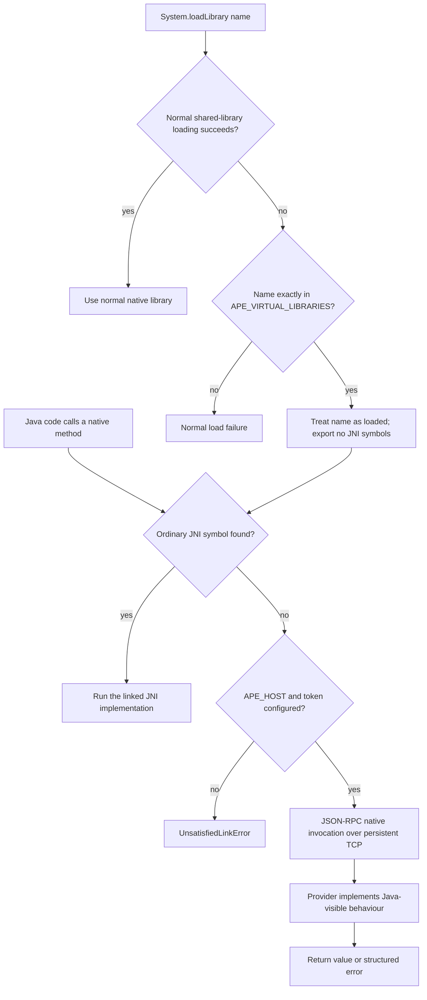

# Java for Cosmopolitan APE

This project contains the complete `lang/java` superconfigure overlay for the
OpenJDK 25.0.4 JRE-only Cosmopolitan port. It builds a fat, portable
`java.com` with x86_64 and aarch64 launchers, plus a separately packaged
repository of optional Java modules.

The repository includes the actual OpenJDK patch, source checksum, configure,
dependency, build, installation, packaging, module-repository scripts, and
runtime tests. Superconfigure supplies the common framework and Cosmopolitan
toolchain.

> **Disclosure and project status.** Most of this experimental project was
> produced with substantial AI assistance. The author defined its boundaries,
> integration approach, and the design questions behind Host Services. It has
> been tested on Windows x64, WSL, Linux x86_64, Linux arm64, and macOS arm64,
> but not across every platform supported by APE. It is not necessarily
> production-ready; anyone interested in long-term, production-quality
> maintenance is welcome to adopt it.

## Install the overlay

[`superconfigure.lock`](superconfigure.lock) pins the released superconfigure
base validated with this overlay: `z0.0.66`. With no argument, the installer
clones that base to `./superconfigure/`, installs this project's complete
`lang/java` recipe, and adds its parent-catalog entry:

```sh
./scripts/install-overlay.sh
```

To use an existing matching checkout, pass it explicitly:

```sh
./scripts/install-overlay.sh /path/to/superconfigure
```

The installer verifies the revision and backs up a replaced `lang/java` tree
under `.ape-overlay-backups/`.

## Build

On WSL, clone into the Linux filesystem (for example `~/src`), not a
`/mnt/c` or `/mnt/d` Windows mount: Cosmocc launches nested APE programs that
DrvFs cannot run reliably. Then run `ulimit -s unlimited`; Cosmopolitan's
large Makefile needs an unlimited shell stack.

```sh
cd /path/to/superconfigure
bash ./.github/scripts/setup
bash ./.github/scripts/cosmo
MAXPROC=4 bash ./.github/scripts/collectbuild lang/java
```

`setup` clones Cosmopolitan at the base project's current revision, and
`cosmo` generates its matching `cosmocc` toolchain. This overlay deliberately
does not download a separate Cosmopolitan archive or a legacy cosmocc release.
The Java recipe fetches and checksum-verifies OpenJDK and its Linux boot JDK on
demand.

It writes:

```text
results/bin/java.com
results/libexec/java-modules.zip
```

`java.com` intentionally stays small: it contains 18 core runtime modules.
`java-modules.zip` holds all 69 Java modules built from the matching OpenJDK
tree. `javacosmofy` can add an application's requested module closure from
that ZIP; source and patch fingerprints reject incompatible combinations.

## Use

```sh
./results/bin/java.com -version
./results/bin/java.com -jar app.jar
./results/bin/java.com -cp classes example.Main
```

The runtime includes a JIT and garbage collector. It does not yet support
conventional JNI shared libraries. Instead, it provides an opt-in Host Services
backend for Java native methods. Optional Java class modules can be appended
to an application APE, but native shared libraries such as AWT's `libawt` are
not embedded in the minimal runtime.

## Native methods and Host Services

`java.com` first uses ordinary JNI resolution. If a native symbol is not
present and Host Services is configured, it can instead call a local provider
that supplies the Java-visible behaviour of that native method. The provider
replaces the implementation; it does not emulate the original shared library's
JNI internals.



Enable a local provider explicitly:

```sh
export APE_HOST=127.0.0.1:49321
export APE_HOST_TOKEN='replace-with-a-random-secret'
./results/bin/java.com -jar app.jar
```

Some existing libraries call `System.loadLibrary()` before their first native
method. If a provider deliberately replaces such a library, list only its
exact name:

```sh
export APE_VIRTUAL_LIBRARIES=awt,fontmanager
./results/bin/java.com -jar app.jar
```

This only bypasses the shared-library load. It does not invent JNI symbols:
each unresolved method still reaches the provider under its exact JVM identity,
such as `java.awt.image.ColorModel.initIDs()V`. A provider may return success
for an initialization method when its replacement implementation has no need
for the original library's private JNI caches.

The v1 protocol is JSON-RPC 2.0 over one persistent loopback TCP connection,
with LSP-style `Content-Length` framing. Java uses the mature Eclipse LSP4J
JSON-RPC implementation; Gson transports the typed value maps. It supports
primitive values, strings, primitive arrays, base64 `byte[]`, class tokens,
and request-scoped Java references. While a native invocation is pending, the
provider may issue an ordered `java.env.execute` request back to Java. See
[`docs/java-host-services.md`](docs/java-host-services.md) for the exact wire
format, value ABI, errors, and boot-loaded shim API.

For an end-to-end provider example, see
[`bear0330/tika-ape`](https://github.com/bear0330/tika-ape), which packages
Apache Tika as a portable executable for use from Python and other languages.

## Tested

The standard `collectbuild lang/java` build was validated using the included
runtime suite:

```sh
./scripts/test-overlay.sh /path/to/superconfigure
```

It verifies the launcher, 18-module profile, JAR execution, `.args`, threads,
files, NIO, DNS, loopback TCP, gzip, SHA-256, XML, logging, management,
preferences, ZIP filesystem, timezone, TLS initialization, EC crypto, HTTP
client, JDBC API, JNDI, and `Unsafe`. The optional repository was also checked
to contain all 69 modules, including `java.desktop` and `java.datatransfer`.

Host Services has a separate localhost protocol smoke test. It exercises
disabled-by-default lookup, exact virtual-library names, interpreter and
compiled native call paths, base64 values, primitive-array mutation, scoped
Java references, bidirectional Java-environment calls, and authentication
errors:

```sh
BASELOC=/path/to/superconfigure \
  ./tests/java/host-services-smoke.sh /path/to/superconfigure/results/bin/java.com
```

## License

This project is licensed under GPL-2.0-only.
OpenJDK-derived files retain their upstream copyright and licensing terms, 
including the Classpath Exception where upstream designates it.
